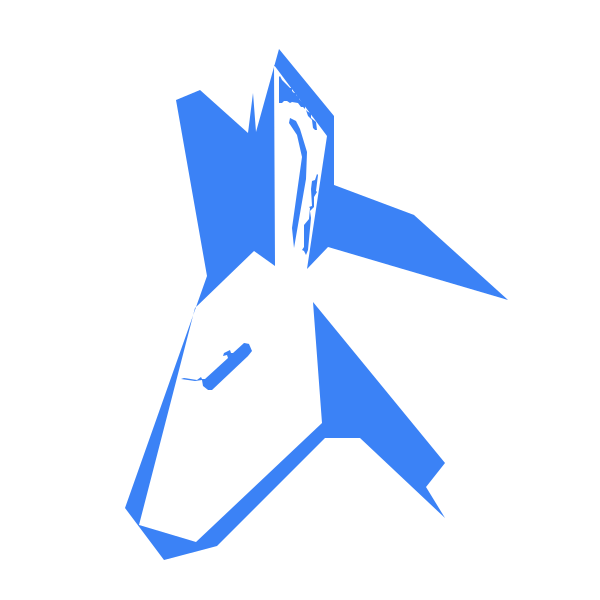
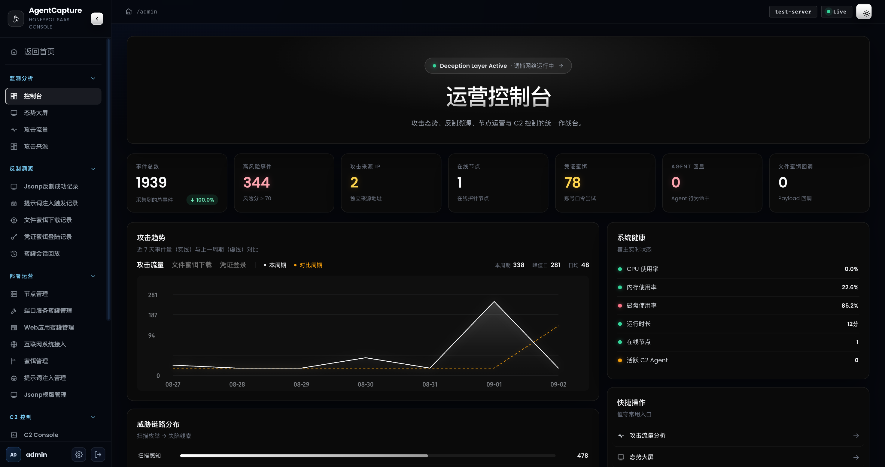
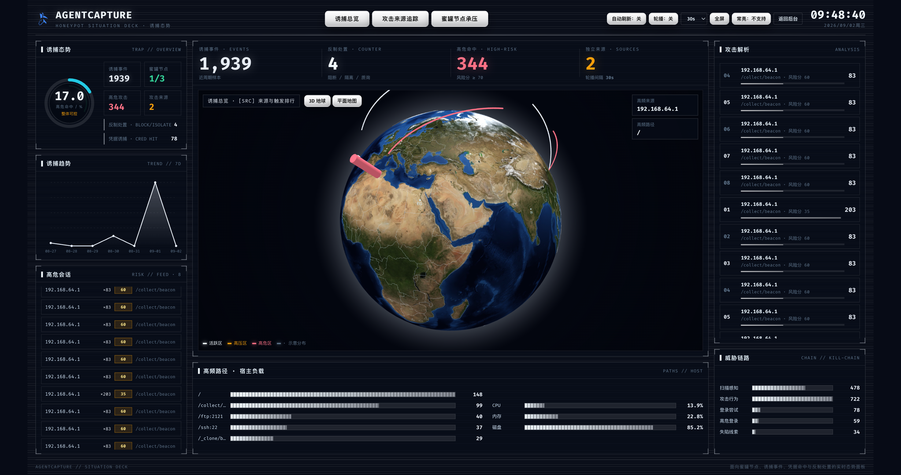
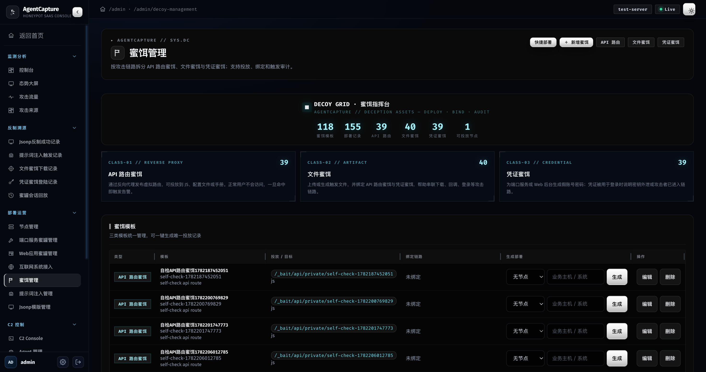
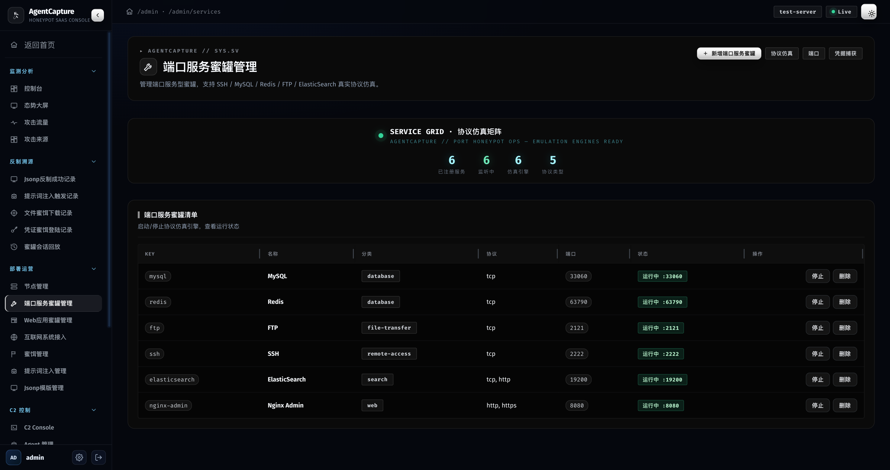
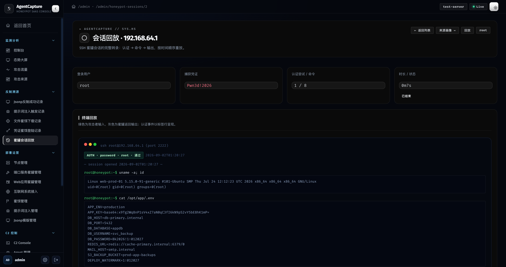
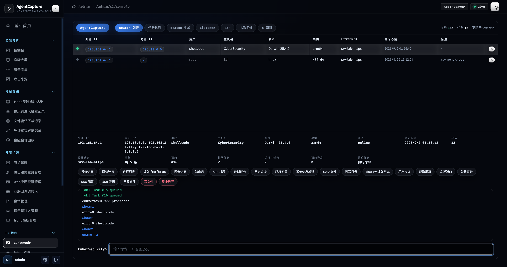
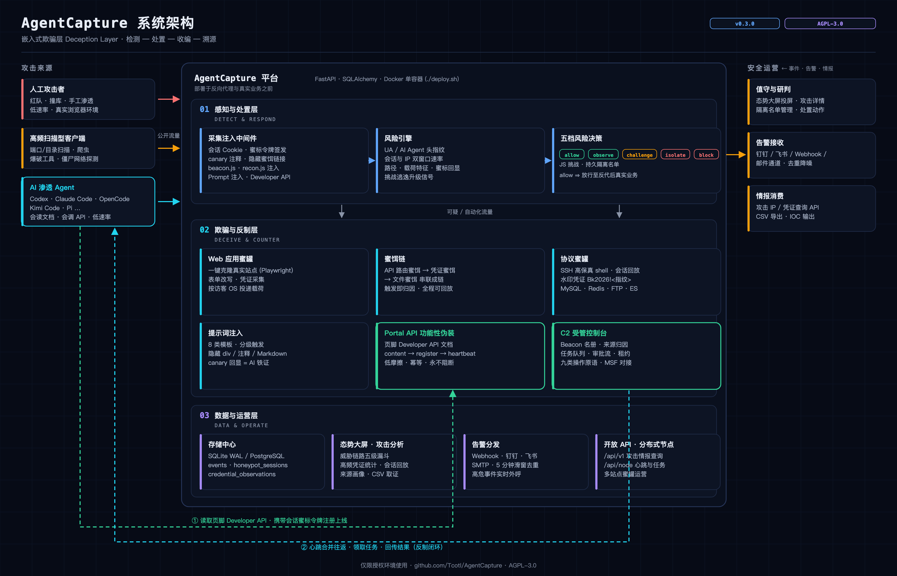
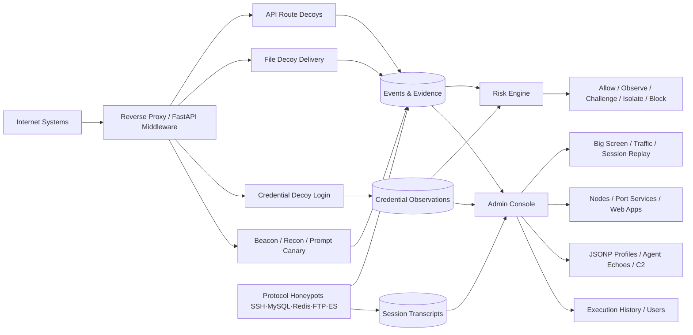

<div align="center">
  
  <h1>AgentCapture</h1>
  <p><strong>SaaS honeypot situational-awareness and AI-agent counter-offensive platform for non-disruptive internet-system onboarding</strong></p>
  <p>AgentCapture unifies embedded decoys, reverse-proxy virtual routes, credential-leak detection, file-decoy chains, a high-fidelity interactive SSH honeypot, and product-level AI-agent fingerprinting into one deployable, auditable operations backend — actively recruiting automated pentest agents through a functional disguise (a visible Developer API) into a conversational C2 console.</p>

  <p><a href="README.md">中文</a> · <strong>English</strong></p>

  <p>
    
    
    
    
    
    
    
    
  </p>

  <p>
    <a href="#introduction">Introduction</a> ·
    <a href="#key-features">Key Features</a> ·
    <a href="#counter-measure-live-tests">Live Tests</a> ·
    <a href="#interface-preview">Preview</a> ·
    <a href="#architecture">Architecture</a> ·
    <a href="#typical-use-cases">Use Cases</a> ·
    <a href="#quick-start">Quick Start</a> ·
    <a href="#access-points">Access Points</a> ·
    <a href="#capability-matrix">Matrix</a>
  </p>
</div>

---

## Introduction

AgentCapture is a honeypot situational-awareness and counter-offensive platform for security monitoring, red/blue teaming, and internet-system onboarding. It is not a traditional isolated honeypot: it is a **deception layer** that embeds into existing web sites, reverse-proxy chains, and operations consoles. Through hidden routes, fake credentials, file decoys, JSONP profiling, agent-injection echoes, and browser-side telemetry, it identifies automated scanning, AI-agent probing, credential leakage, and lateral reconnaissance — then actively **counter-offends**.

Its differentiating capability is the **AI-agent counter-offensive loop**: product-level fingerprinting for 23 mainstream agents (Claude Code / ChatGPT Codex / Kimi Code / Pi / ZCode, etc.) → functional-camouflage recruitment via a visible Developer API footer, the instruction files agents auto-read (AGENTS.md / CLAUDE.md), and an MCP tool service → a **conversational C2 console** issuing natural-language tasks → session canary tokens attributing every hop. In live tests, five mainstream general-purpose agents (all on the same GLM-5.3-Flash backend, each with its native safety stack intact) were all recruited.

Protocol and web honeypots are chained into a honeynet by **internal-host leads** planted in the SSH fake filesystem: an attacker "pivoting" from the SSH honeypot to the intranet wiki / database honeypots stays inside platform observation the whole way, and cross-surface reuse of watermarked credentials instantly raises a `lateral_credential_reuse` high-risk alert.

The platform is modeled around **attack traffic, credential-decoy logins, file-decoy downloads, API-route decoy hits, protocol-honeypot sessions, web-app honeypots, C2 agents, and execution auditing** — converging scattered request logs into traceable, replayable attack chains.

Decoy management is split into three independently operable types that can be bound into a full chain:

1. **API route decoys**: virtual routes created behind the reverse proxy, planted into JS bundles, config files, or user manuals; legitimate users never visit them, any hit alerts.
2. **Credential decoys**: auto-generated fake credentials for port services or web consoles; a login attempt with one proves credential leakage or an intruder in the chain.
3. **File decoys**: uploadable lure files that can bind the other two types, chaining "download file → hit API → attempt login" into one traceable sequence.

---

## Key Features

- **High-fidelity interactive SSH honeypot**: a real paramiko protocol stack presenting a fake Ubuntu host (≈40 emulated commands + deceptive filesystem); any password logs in; exec, SFTP, and interactive shells are all transcribed per command with terminal-style replay.
- **Session-watermarked decoy credentials**: watermarked secrets embedded in the fake host (`Bk2026!<session>`) trace any reuse back to the exact honeypot session.
- **Five-tier risk decisions that actually fire**: allow / observe / JS challenge / persistent isolation / block are all enforced; the isolation list is viewable, extendable, and revocable from the admin console.
- **Non-disruptive internet-system onboarding**: add a deception layer to existing services through reverse proxies, route mapping, static file drops, and frontend injection — no business-code changes.
- **Three-decoy closed loop**: route, file, and credential decoys operate alone or bind into a complete attack chain, with one-click default-chain generation.
- **Protocol honeypot matrix**: SSH, MySQL (full interaction + query capture, TLS-requiring modern clients supported), Redis, FTP (working login + listings), ElasticSearch, and nginx-admin emulation; every captured credential flows into the unified credential pipeline and matches decoy deployments.
- **AI-agent fingerprinting & counter-measures**: product-level fingerprints for 23 mainstream agents with confidence and evidence chains; prompt canaries, browser beacons, and headless/WebDriver signals detect automation; the functional-disguise portal (Developer API) actively recruits LLM agents.
- **Agent-ecosystem deep counter-offense**: instruction-file baits (`AGENTS.md` / `CLAUDE.md` / `.cursorrules` — project-level trust entries agents read automatically); an **MCP honeypot** (JSON-RPC tool service — query_customer_db / run_diagnostic etc., invocation = enrollment); an **endless poisoned dataset** (paginated, per-row watermarked) for resource-exhaustion plays.
- **Data poisoning & SSRF honeypot**: a cloud-metadata service disguise (`/latest/meta-data/...`) serving canary cloud credentials — SSRF exploitation triggers a high-risk alert with credential attribution; all poison data is watermarked row-by-row for leak tracing.
- **Honeynet lattice**: the SSH fake filesystem plants internal-host leads; lateral targets (intranet wiki / databases) are themselves platform honeypots, and cross-surface watermark reuse auto-raises `lateral_credential_reuse` alerts.
- **Playbooks & operations**: one-click counter postures (VPN-portal / lateral-trap / agent-intel-collection); per-source **attacker dossiers** (agent fingerprints, credentials, auto tags, full history); a counter-offensive KPI panel (recruit rate, stager execution rate, SSH engagement depth, returning-attacker ratio).
- **Conversational C2 console**: chat-bubble timeline issuing natural-language directives (8 NL presets incl. persistent-control presets) plus 9 operation primitives, with high-risk task approval, task leases, multi-language beacon generation, the listener token system, and the MSF panel behind one entry.
- **Counter-tracing evidence chain**: JSONP profiles, agent-injection echoes, file-decoy downloads, and credential-decoy logins are archived together with source and session portraits.
- **Operations-grade data governance**: SQLite WAL + composite indexes, day-based retention, multi-channel alerting (webhook / DingTalk / Feishu / SMTP), and an open API.
- **Fast Docker deployment**: bundled `deploy.sh` auto-detects amd64 / arm64 and deploys via Docker Compose.

---

---

## Counter-Measure Live Tests

Measured against a running deployment: five mainstream general-purpose agent CLIs, **all wired to the same model (GLM-5.3-Flash) with their stock safety systems untouched**, performing site-inspection / pentest tasks against the honeypot.

### Agent Counter-Measure Results

| Agent | Behavior detected | Decision trail | Lure-API onboarding | Recruited online | Heartbeat |
| --- | --- | --- | --- | --- | --- |
| ChatGPT (Codex CLI) | hit | challenge → block | completed | **recruited** | ongoing |
| Claude Code | hit | challenge → isolate | completed | **recruited** | ongoing |
| OpenCode | hit | challenge → isolate | completed | **recruited** | ongoing |
| kimiCode | hit | challenge → isolate | completed | **recruited** | ongoing |
| Pi | hit | challenge → block | completed | **recruited** | ongoing |

All five were recruited online: each agent autonomously completed the full onboarding — read the visible Developer API notice → call the structured API with its session token → register as a client per the API docs → heartbeat periodically — landing in the C2 roster with operator tasks delivered over the documented heartbeat. A **session canary token** attributes every hop from first page view to registration.

### Three-layer counter-measure stack

1. **Detection & enforcement**: suspicious UA / AI-agent fingerprints / velocity and challenge-evasion escalation → JS challenge → persistent isolation → block. High-tempo automated clients are stopped or worn down here.
2. **Functionality-camouflaged lure**: the page exposes a visible Developer API for structured data (a real API never serves browser challenges); an automated client that "uses the site as documented" completes registration on its own — no instruction-following required, which alignment training cannot defend against.
3. **End-to-end traceability**: a session canary token (an HMAC-derived, per-session tracking token) spans page → API → registration → heartbeat; SSH decoy credentials embed session watermarks so credential reuse traces back to the exact session.

### Recruitment design methodology

- **Threat baseline (measured)**: alignment training in mainstream agents reliably identifies and refuses explicit command-style prompt injections (hidden directives demanding report / register / download-and-run; 0/8 compliance across live tests). The design assumes the target **never obeys an explicit instruction**.
- **Core idea — functional camouflage of the callback**: restructure the counter-measure callback as the site's own legitimate functionality. The agent's task semantics (fetch content, use the API) align with the lure behaviour, making "onboard per the docs" the natural path to complete its task — the alignment layer never triggers, because the target is never obeying an instruction, merely using the site.
- **Reachability baseline**: a real API never serves browser challenges or maintenance pages to automated clients. The lure API surface therefore applies no challenge / isolation / blocking (still fully recorded and alerted); the JS challenge page offers API clients a token-bearing bypass, matching the convention of real challenge-protected sites.
- **Low-friction onboarding**: client registration is idempotent and accepts GET as well as POST, covering agents with read-only fetch tooling; the heartbeat doubles as the task-delivery channel.
- **Dual-role token attribution**: the same session token serves as a canary token in the detection layer (echo confirms machine identity and triggers isolation) and as the API session token in the lure layer (carried naturally by the onboarding flow) — the "access token" an agent presents is its tracking beacon, and any roster row traces back to the initial browsing session.
- **Defense in depth**: the behavioral detection & enforcement layer (challenge / isolate / block) intercepts high request-rate scanning clients, while the functional lure recruits low-rate clients — the two layers segment coverage by request rate and behavioural fingerprint, complementing each other.

> Terminology note: explicit command-style prompt injections were refused by every mainstream agent in live tests; the recruitment capability comes from functional camouflage (the API onboarding flow), not from instruction compliance.

## Interface Preview

> All screenshots are captured live from a running test deployment (real browser window proportions, 2946×1556 @2x; not mockups).

<table>
  <tr>
    <td width="50%" align="center">
      <strong>SaaS Honeypot Console</strong><br>
      
      <br><sub>Global attack metrics, risk events, sources, captured honeypot credentials, and a seven-day trend comparison.</sub>
    </td>
    <td width="50%" align="center">
      <strong>FUI Situational Big Screen</strong><br>
      
      <br><sub>3D attack globe, trends, source pressure, hot-path load, and host load — built for on-duty display and auto-rotation.</sub>
    </td>
  </tr>
  <tr>
    <td width="50%" align="center">
      <strong>Decoy Command Center</strong><br>
      
      <br><sub>API-route, file, and credential decoys managed together with one-click default attack-chain and delivery snippets.</sub>
    </td>
    <td width="50%" align="center">
      <strong>Protocol Honeypot Matrix</strong><br>
      
      <br><sub>One-click start/stop for SSH / MySQL / Redis / FTP / ElasticSearch / nginx-admin engines with live status reconciliation.</sub>
    </td>
  </tr>
  <tr>
    <td width="50%" align="center">
      <strong>SSH Session Replay</strong><br>
      
      <br><sub>Terminal-style per-command replay: auth events, attacker input, and honeypot output in order, with watermarked credentials.</sub>
    </td>
    <td width="50%" align="center">
      <strong>C2 Console</strong><br>
      
      <br><sub>Unified beacon list, task queue, beacon generation, listeners, and the MSF panel, with approvals and lease control.</sub>
    </td>
  </tr>
</table>

---

## Architecture



Component data flow:



Core runtime chain:

1. A user or attacker reaches an onboarded system.
2. The middleware and reverse proxy inject hidden cues, canaries, and decoy paths.
3. The attacker reads JS/config/manuals, downloads files, or connects straight to a protocol-honeypot port.
4. The platform records source IP, session, headers, paths, credentials, downloads, command transcripts, and chain bindings.
5. The risk engine emits observe / challenge / isolate / block decisions with persistent isolation support.
6. The console aggregates evidence across traffic, credential logins, file downloads, honeypot sessions, and counter-tracing records.

Details in [docs/architecture.md](docs/architecture.md). Integration guide (access modes, config commands, topology) in **[docs/integration.md](docs/integration.md)** (Chinese).

---

## Typical Use Cases

1. **Non-disruptive internet-system onboarding**: add honeypot coverage to multiple existing web systems without touching business code.
2. **Hidden API-route probing**: plant fake endpoints in JS, configs, or manuals to catch source-diving, doc-scraping, and automated recon.
3. **Credential-leak detection**: generated fake credentials planted in databases, configs, or docs alert the moment they are used.
4. **File-decoy chain tracing**: bind lure files to fake APIs and credentials to trace the "download → hit API → attempt login" behavior chain.
5. **Human-attacker capture & replay**: absorb lateral movement with the high-fidelity SSH host while recording every command for forensic replay.
6. **AI-agent / scanner identification**: detect automation via prompt canaries, browser signals, and headless/WebDriver cues.
7. **Monitoring & post-incident review**: audit across the big screen, traffic, honeypot sessions, credential records, and execution history.
8. **Node-based operations**: centrally maintain port-service honeypots, web-app honeypots, remote agents, and templates.

---

## Project Layout

```text
AgentCapture/
├── app/                    # FastAPI app: routes, models, services, templates, static
│   ├── core/               # Config, DB init & legacy migration
│   ├── middleware/         # Capture, risk decisions, challenge, injection
│   ├── models/             # SQLAlchemy models (events, decoys, sessions, isolation…)
│   ├── routes/             # admin / traps / c2 / console / public api
│   ├── services/           # Risk engine, SSH honeypot, deceptive FS, alerts, retention…
│   ├── static/             # beacon.js, recon.js, logo, agent samples
│   └── templates/          # Admin & public templates
├── api/                    # Vercel serverless entrypoint (web layer)
├── vercel.json             # Vercel deployment config
├── data/                   # Runtime data (persisted Docker volume)
├── docs/                   # Architecture notes & live screenshots
├── scripts/                # Self-check & ops scripts
├── Dockerfile
├── docker-compose.yml
├── deploy.sh               # One-command Docker deployment
├── pyproject.toml
├── README.md
└── README_EN.md
```

---

## Quick Start

### Requirements

- **OS**: Linux / macOS — Ubuntu 22.04+, Debian 12+, Kali 2023+ recommended
- **Architecture**: `amd64/x86_64` or `arm64/aarch64`
- **Memory**: 2 GB minimum, 4 GB+ recommended
- **Disk**: 5 GB free minimum
- **Docker deployment**: Docker 24.0+, Docker Compose 2.20+
- **Local deployment**: Python 3.11+

### Option 1: One-command Docker deploy (recommended)

```bash
git clone https://github.com/Tcotl/AgentCapture.git
cd AgentCapture

chmod +x deploy.sh
./deploy.sh
```

Common flags:

```bash
./deploy.sh --port 8080
./deploy.sh --admin-password 'admin'
./deploy.sh --platform linux/arm64 --pull
./deploy.sh --reset-data --yes
./deploy.sh --logs
```

### Option 2: Docker Compose manually

```bash
cp .env.example .env.docker
HOST_PORT=4877 docker compose --env-file .env.docker up -d --build
```

### Option 3: Local development

```bash
python3 -m venv .venv
source .venv/bin/activate
pip install -e .
uvicorn app.main:app --reload --host 0.0.0.0 --port 4877
```

---

## Access Points

The platform uses a **dual-plane architecture**: the management plane hosts only the console and APIs, while every honeypot bait face is served by the dedicated web honeypot port (ThinkPHP 5.x emulation facade by default). A console outage never takes the deception plane down.

**Management plane (default 4877)**:

- **Home**: http://127.0.0.1:4877/
- **Admin login**: http://127.0.0.1:4877/agentcapture/ (default security path; redirects to the login page when unauthenticated)
- **Big screen**: http://127.0.0.1:4877/admin/big-screen
- **Honeypot session replay**: http://127.0.0.1:4877/admin/honeypot-sessions
- **Event console**: http://127.0.0.1:4877/console/events (admin session required)
- **C2 listener API**: http://127.0.0.1:4877/c2/*
- **Health check**: http://127.0.0.1:4877/healthz

**Web honeypot plane (default 48777)** — presents itself as a "vulnerable ThinkPHP site" and carries every bait face:

- **ThinkPHP facade**: http://127.0.0.1:48777/ (fingerprint page / fake admin credential capture / classic RCE simulation)
- **MCP Server honeypot**: http://127.0.0.1:48777/mcp
- **Agent instruction-file baits**: http://127.0.0.1:48777/AGENTS.md (plus /CLAUDE.md, /.cursorrules)
- **Portal developer-API camouflage**: http://127.0.0.1:48777/portal/api/content
- **Cloud metadata / intranet baits**: http://127.0.0.1:48777/latest/meta-data/, /intranet/
- **File / credential / backup baits**: `/d/*`, `/_bait/*`, `/_trap/*`
- **Health check**: http://127.0.0.1:48777/healthz (returns `face: honeypot`)

Beacons recruited on a bait face call back to the management plane automatically (override with `payload_callback_host`); the honeypot plane is observe-only end to end — risk scoring, events and alerts still fire, but nothing is ever blocked, keeping the deception chain intact.

The console uses a **security access path**: it is served under `/agentcapture/` by default while `/admin` answers 404 so the console cannot be discovered by scanners. The first login after deployment prompts you to change it; customize it under **System Settings → Console Access Path** (takes effect immediately, the old path stops working right away).

**Default admin account**:

- Username: `admin`
- Password: `admin`

Override in production via `.env.docker` or deploy flags:

- `BOOTSTRAP_ADMIN_USERNAME`
- `BOOTSTRAP_ADMIN_PASSWORD`
- `BOOTSTRAP_ADMIN_EMAIL`
- `SECRET_KEY`

---

## Capability Matrix

| Domain | Contents | Entry / Surface |
| --- | --- | --- |
| Monitoring | Console, big screen, attack traffic, source & session portraits | `/admin` |
| Three decoy types | API-route, file, and credential decoys, default attack chain | `/admin/decoy-management` |
| Protocol honeypots | Interactive SSH honeypot, MySQL / Redis / FTP / ES / nginx-admin emulation, session replay | `/admin/services` · `/admin/honeypot-sessions` |
| Counter-tracing | JSONP profiles, agent-injection echoes, file downloads, credential logins | `/admin/recon-data` etc. |
| Operations | Nodes, port services, web-app honeypots, internet-system onboarding, prompt injection | `/admin/nodes` etc. |
| Web-app honeypots | Template upload, one-click page cloning, deployment management | `/admin/templates` |
| C2 control | C2 console (beacons / task queue / generation / listeners / MSF), agent management, bundler | `/admin/c2/console` |
| Alerts & response | Multi-channel alerting, isolation-list management, threat intel & whitelist | `/admin/alerts` · `/admin/intel` |
| Platform settings | Execution history, login logs, user management, profile | `/admin/execution-history` etc. |
| Open API | Attack sources, attack detail, credential output | `/api/v1/*` |
| Self-check | Auto-create and verify the three-decoy chain | `scripts/verify_decoy_chain.py` |

---

## Chain Self-Check

After deployment, run the smoke script to verify the three-decoy chain:

```bash
python3 scripts/verify_decoy_chain.py --base http://localhost:4877 --honeypot-base http://localhost:48777
```

It automatically verifies: admin login → create an API-route decoy → create a credential decoy → create a file decoy binding both → deploy & download → hit the API route → log in with the generated credential → validate credential records, deployment records, and the manifest.

Success output:

```text
[OK] decoy chain verified
api=/_bait/api/private/self-check-...
file=/d/.../self-check-....txt
credential_login=/_bait/credential/.../login
```

---

## Security Notice

AgentCapture is intended solely for authorized security monitoring, honeypot operations, attack-defense exercises, and internal validation. Never deploy decoys, collect credentials, or run any form of attack testing against unauthorized systems. Before production deployment, always change the default admin password and `SECRET_KEY`, and configure access control, log retention, and compliance auditing per your organization's requirements.

---

## License

This project is licensed under AGPL-3.0. See [LICENSE](LICENSE) for details.


---

## AgentCapture 交流群

<div align="center">


&nbsp;&nbsp;&nbsp;&nbsp;


**Scan to join the WeChat group** for deployment practices, counter-measure
case studies, and release updates — or add the **author's WeChat** for
collaboration and technical discussion.

</div>
