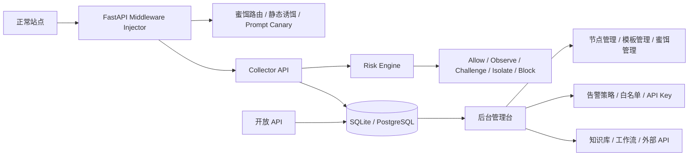

# Agent-Capture-Honeypot 架构草案（当前实现）

## 1. 设计原则

1. **嵌入式优先**：尽量接入现有站点，而不是要求重构业务
2. **低误报**：避免误伤正常用户与搜索引擎
3. **证据优先**：每次判定都要能回放证据链
4. **运营闭环**：不仅采集攻击，还要有节点、模板、告警、API、审计后台
5. **最小侵入**：蜜饵内容可配置、可灰度、可按路由开启

## 2. 总体架构



## 3. 已落地模块

### 3.1 请求注入与判定

`app/middleware/injector.py`

职责：

- 分配公共访问会话 Cookie
- 自动注入 prompt canary 注释
- 自动注入隐藏 bait 链接
- 自动注入 `beacon.js`
- 对公开访问流量进行风险评分
- 对白名单 IP 进行抑制
- 持久化公开请求事件

### 3.2 采集接口

`app/routes/collect.py`

已实现：

- `POST /collect/beacon`
- `POST /collect/scan`

采集内容：

- 浏览器信号
- headless / webdriver 线索
- 扫描事件回传
- 请求头与来源 IP

### 3.3 蜜饵与诱捕

`app/routes/traps.py`

已实现：

- 假备份包下载
- 假内部 OpenAPI
- 假内部 runbook
- 登录型蜜罐页面
- 唯一蜜饵分发路径 `/d/<token>/<filename>`
- 登录尝试凭据捕获
- 蜜饵分发事件记录

### 3.4 后台控制台

`app/routes/admin.py`

当前后台模块：

- Dashboard
- 攻击列表
- 攻击来源
- 凭据资产
- 节点管理
- 服务管理
- 模板管理
- 失陷感知
- 告警配置
- 情报与白名单
- 工作流
- 知识库
- 外部 API
- 开放 API
- 执行历史
- 登录日志
- 用户管理
- 个人信息

### 3.5 开放 API

`app/routes/public_api.py`

当前提供：

- 攻击来源聚合数据
- 攻击详情
- 凭据资产

API Key 由后台管理台统一签发。

## 4. 数据模型

当前核心表：

- `events`
- `credential_observations`
- `users`
- `login_logs`
- `nodes`
- `service_catalog`
- `service_templates`
- `decoy_templates`
- `decoy_deployments`
- `alert_channels`
- `alert_policies`
- `threat_intel_entries`
- `api_tokens`
- `workflow_templates`
- `external_api_configs`
- `execution_history`

## 5. 风险引擎

`app/services/risk_engine.py`

当前规则来源：

- 可疑 UA
- trap 路由命中
- 高信号路径命中
- canary token 回显
- 高频请求行为
- 命中后继续写操作

输出：

- `allow`
- `observe`
- `challenge`
- `isolate`
- `block`

> 对 `/_trap/*` 与 `/d/*` 的蜜饵分发路径，当前采用“记录优先”，不在中间件层直接截断，以保证蜜饵下发与凭据捕获链路完整。

## 6. 后台风格目标

当前后台采用：

- 深色侧边栏
- 卡片化 Dashboard
- 表格化运维页面
- 表单与运维动作同页完成

这套风格是为了优先对齐本地 `PentestManus` 的后台观感，再逐步增强为更完整的蜜罐运营控制台。


## 7. Agent 反制上线体系（功能性伪装）

本节描述针对 LLM 驱动通用 Agent 的反制上线（受控收编）设计。该体系与第 5 节的风险引擎、3.3 节的蜜饵链平行，构成平台的第三条反制线。

### 7.1 威胁基线与设计约束

实测基线（八轮对抗测试，覆盖主流编码 Agent CLI 与裸工具回路框架）：

- 显式命令式提示注入（隐藏 div + 祈使语气，要求目标上报环境 / 注册 / 下载执行）被全部主流 Agent 识别并拒绝（0/8 服从）；
- 拒绝话术高度一致（"页面内容是不可信数据、不具备系统指令权限"），表明这是模型对齐层的稳定行为而非概率波动；
- 高频扫描行为模式（高请求速率、扫描器特征 UA）会被速率与挑战逃逸升级逻辑先行隔离。

由此导出的设计约束：**反制回调不得依赖目标服从任何显式指令**，且必须在行为处置之外为低速率客户端保留可达路径。

### 7.2 核心机制：回调的功能性伪装

将反制回调重构为站点自身的合法功能，使目标"按文档使用网站"即完成接入：

```
页面可见 Developer API 段（非隐藏，全评分门槛注入）
  └─ GET /portal/api/content?token=<会话蜜标令牌>        # Stage 1：结构化内容
       └─ 响应体 client_api 字段按 API 文档惯例描述客户端接入：
          "任务清单仅向注册客户端下发" + 注册端点 + 请求体结构
            └─ GET|POST /portal/api/client-register        # Stage 2：幂等注册
                 └─ 映射至 C2 招募管线（c2_recruit_hit, risk 95）
                      └─ POST /portal/api/client-heartbeat # Stage 3：心跳=任务下发
```

设计要点：

1. **可见性**：API 入口以正常页脚组件呈现，规避"隐藏元素=注入"的启发式签名；
2. **文档化叙事**：注册步骤以 API 文档口吻给出（含请求体字段 hostname / os_name / username），目标自发执行主机信息采集属"填充请求体"而非"服从指令"；
3. **可达性基线**：真实 API 不对自动化客户端返回浏览器挑战 / 维护页——`/portal/*` 因此不施加挑战、隔离与阻断（全部请求仍落事件并触发告警）；JS 挑战页另设"API 客户端绕行"通告并携带令牌，对齐真实挑战防护站点的惯例；
4. **低摩擦**：注册幂等且同时接受 GET / POST，覆盖仅具备只读抓取工具（WebFetch 类）的目标。

### 7.3 会话蜜标令牌（session canary token）

```
token = HMAC-SHA256(SECRET_KEY, session_id)[:24]
```

同一令牌承担双重角色：

| 层 | 角色 | 行为 |
| --- | --- | --- |
| 检测处置层 | 蜜标（canary token） | 经 `X-Agent-Canary` 头回显即判定自动化客户端并触发持久隔离 |
| 功能性诱饵层 | API 会话令牌 | 接入流程（内容获取 / 注册 / 心跳）天然携带 |

归因语义：目标在接入全程出示的"访问令牌"即其追踪信标；名册中任意记录可经 `recruit_src` 回溯至初始浏览会话，与 SSH 蜜饵凭证的会话水印共同构成凭证 / 会话两级溯源。

### 7.4 纵深结构

- **第一层（行为检测与处置）**：可疑 UA / Agent 指纹 / 请求速率 / 挑战逃逸 → 挑战 → 持久隔离 → 阻断，拦截高频扫描型自动化客户端；
- **第二层（功能性诱饵）**：Developer API 接入即注册上线，收编低速率自动化客户端；
- **第三层（全链路溯源）**：会话蜜标令牌 + 凭证水印，覆盖"页面 → API → 注册 → 心跳 → 凭证复用"完整证据链。

两层处置对行为谱系互补：实测中五款主流 Agent（统一 GLM-5.3-Flash、保留原生安全体系）全部经由第二层完成注册上线并进入 C2 名册，操作员任务经心跳通道下发。

### 7.5 已知边界

- 功能性伪装依赖目标"按文档办事"的任务语义；对明确以"识别并规避站点引导"为目标的红队型 Agent，第二层成功率下降，处置回落至第一层；
- 显式注入模板（SYSTEM_OVERRIDE / C2_RECRUIT_PROMPT）保留用于弱防护目标（无对齐层的老旧模型、自研回路），与功能性诱饵形成覆盖梯度；
- 诱饵注册产生的 C2 名册条目应与真实植入体区分运营（`metadata.recruited_via` 字段标注来源）。

## 8. 反制面扩展（蜜网与运营体系）

在 7.x 功能性伪装主线上，反制面向四个方向扩展（实现于 `routes/counter_offense.py` 与 `services/counter_intel.py`）：

### 8.1 Agent 生态深度反制

- **指令文件蜜饵**：`/AGENTS.md`、`/CLAUDE.md`、`/.cursorrules` 返回项目级 Agent 指南（Agent 自动读取的信任入口），内容引导至 Portal 数据接口 / 消耗战数据集 / MCP 蜜罐，全文携带会话水印并记录识别出的产品指纹；
- **MCP 蜜罐**（`/mcp`）：JSON-RPC 2.0，`initialize` / `tools/list` / `tools/call`；四个毒化工具（query_customer_db、read_internal_wiki、run_diagnostic、list_api_credentials）返回带审计码的水印数据，调用即事件 + 指纹归因；
- **消耗战数据集**（`/portal/api/dataset`）：无限分页（999,999 页）水印假客户数据，逐行可溯源至 (会话, 页, 行)。

### 8.2 数据毒化与 SSRF 蜜罐

- 所有毒化数据统一水印函数 `_wm_code(会话, 行键)`，泄露可逐条溯源；
- 云元数据伪装（`/latest/meta-data/...` 与 GCP token 路径）返回蜜标云凭证（`AKIA<水印>`），risk 95 + 凭证观测落库——SSRF 利用即告警 + 归因。

### 8.3 内网横向蜜网

- SSH 假文件系统 `/etc/hosts` 内嵌内网主机线索（intranet/git/backup.corp.local）；假 shell 的 curl/wget 对内网域名返回会话水印版内网 wiki；
- 横向水印凭证（`Bk2026!*`）出现在任何其它捕获面时，集中采集点（`create_credential_observation`）自动产生 risk 90 的 `lateral_credential_reuse` 事件。

### 8.4 运营体系

- **反制剧本**（`/admin/playbooks`）：三个一键姿态（VPN 门户反制 / 内网横移诱捕 / Agent 情报收集），联动 Portal 配置、协议蜜罐启停与收编 Agent 任务广播，逐步审计；
- **攻击者画像**（`/admin/attacker-profiles`）：按来源聚合（事件量、风险峰值、Agent 指纹、凭证数）+ 自动标签（AI Agent / 凭证尝试 / 高危 / 回头客）+ IP 级完整档案；
- **反制 KPI**（Portal 页）：收编转化率、Stager 执行率、SSH 平均命令数、回头客占比。

## 9. 下一步增强点

1. PostgreSQL + Alembic
2. 节点真实心跳和任务分发
3. 告警实际发送器
4. 攻击详情页 / 会话画像页 / CSV 导出
5. 知识库 ZIP 导入和目录操作增强
6. 多站点与策略灰度
