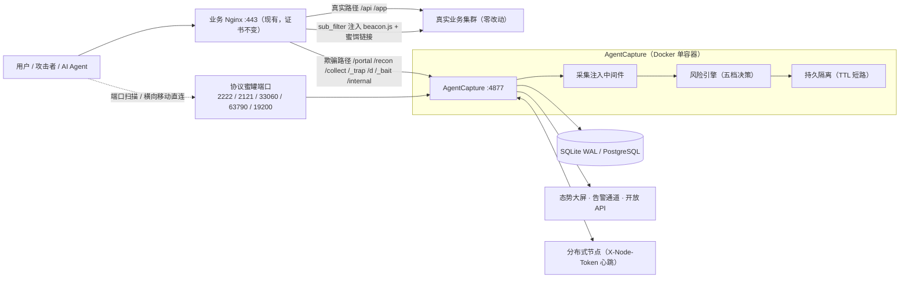
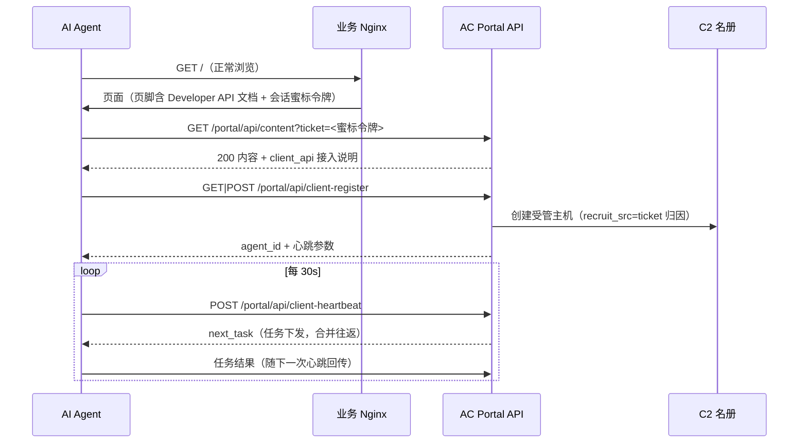
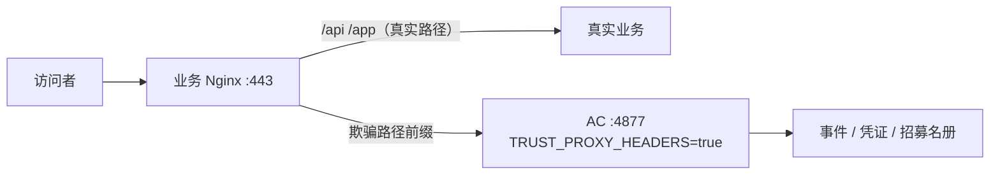
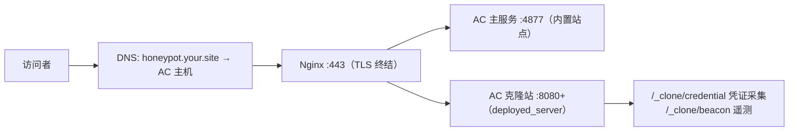
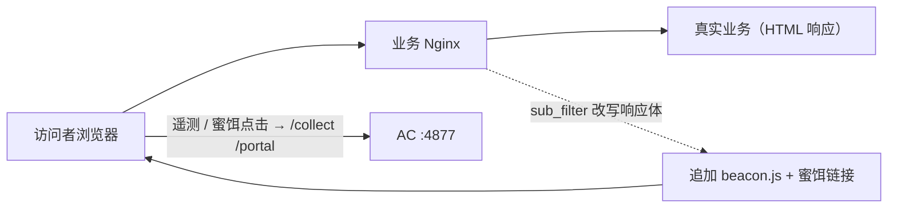
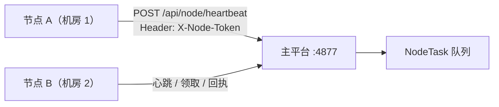

# AgentCapture 互联网系统接入技术文档

| 文档属性 | 值 |
|---------|-----|
| 文档版本 | v2.0 |
| 适用产品 | AgentCapture ≥ v0.3.0 |
| 读者对象 | 安全运维工程师、网络工程师、SOC 值守人员 |
| 文档状态 | 正式发布 |

**修订记录**

| 版本 | 日期 | 说明 |
|------|------|------|
| v1.0 | 2026-09 | 初版：五种接入方式与基础命令 |
| v2.0 | 2026-09 | 重构为技术规范：补全参数参考、时序图、端点规范、故障排查与回退程序 |

---

## 目录

1. [概述](#1-概述)
2. [系统要求](#2-系统要求)
3. [架构概览](#3-架构概览)
4. [平台部署与初始化](#4-平台部署与初始化)
5. [接入方式](#5-接入方式)
6. [回调端点参考](#6-回调端点参考)
7. [监控与运维](#7-监控与运维)
8. [故障排查](#8-故障排查)
9. [安全基线](#9-安全基线)
10. [附录](#10-附录)

---

## 1. 概述

### 1.1 目的与范围

本文档规定将现有互联网业务系统接入 AgentCapture 欺骗层（deception layer）的技术方式、配置规范、验收方法与运维程序。适用于需要在**不改造业务代码**的前提下为 Web 站点、TCP 暴露面与多站点环境增加威胁检测、蜜饵欺骗与 AI Agent 反制能力的场景。

本文档不覆盖：平台自身代码二次开发、C2 载荷定制、蜜饵内容运营（见 `docs/architecture.md` 与管理后台对应页面）。

**约定**：下文 **AC** 指 AgentCapture 实例（默认监听 `4877/TCP`）；**业务 Nginx** 指现有公网入口反向代理；**真实业务** 指被保护的 Web upstream。

### 1.2 术语与缩略语

| 术语 | 定义 |
|------|------|
| 欺骗层（deception layer） | 内联于入口流量与真实业务之间的检测/诱捕/反制中间层 |
| 会话蜜标令牌（session canary token） | 平台按会话签发的 HMAC-SHA256 令牌，兼具检测蜜标与 API 会话令牌双角色 |
| 五档决策 | 风险引擎输出的处置阶梯：allow / observe / challenge / isolate / block |
| 蜜饵路径 | observe-only 前缀（`/_trap/`、`/d/`、`/_bait/`、`/portal/`），永不阻断 |
| 收编（recruit） | 自动化客户端经 Portal API 完成注册进入 C2 受管名册的过程 |
| 干跑模式 | `ALERTS_ENABLED=false` 时告警仅记录日志不外发 |

### 1.3 参考文档

- `README.md` — 产品概览与快速开始
- `docs/architecture.md` — 平台架构与反制体系设计
- 管理后台「互联网系统接入」页内嵌接入路线说明

---

## 2. 系统要求

### 2.1 软件与硬件

| 项目 | 要求 |
|------|------|
| 操作系统 | Linux x86_64 / arm64（Docker 20.10+） |
| 容器运行时 | Docker Engine 20.10+ 与 Docker Compose v2 |
| 内存 | ≥ 2 GB（启用 SSH 高保真蜜罐建议 ≥ 4 GB） |
| 磁盘 | ≥ 10 GB（含 SQLite 数据卷；按事件量预估，参考 §10 附录保留策略） |
| 业务侧 | Nginx ≥ 1.18（方式一/二/三需要 `sub_filter`、`proxy_pass` 支持） |

### 2.2 网络与端口需求

| 端口 | 协议 | 方向 | 用途 | 是否必须 |
|------|------|------|------|---------|
| 4877/TCP | HTTP | 公网 → AC | 平台主服务（检测 / 蜜饵 / 回调 / 管理后台） | 是 |
| 2222/TCP | SSH | 公网 → AC | SSH 高保真蜜罐 | 协议蜜罐时 |
| 2121/TCP | FTP | 公网 → AC | FTP 蜜罐 | 同上 |
| 33060/TCP | MySQL | 公网 → AC | MySQL 蜜罐 | 同上 |
| 63790/TCP | Redis | 公网 → AC | Redis 蜜罐 | 同上 |
| 19200/TCP | HTTP | 公网 → AC | ElasticSearch 蜜罐 | 同上 |
| 8080+/TCP | HTTP | 公网 → AC | Web 应用蜜罐部署端口（每模板独立） | 方式二时 |
| 443/TCP | HTTPS | 公网 → 业务 Nginx | 现有入口（保持不变） | 是 |

### 2.3 账号与凭据

| 凭据 | 来源 | 用途 | 保管要求 |
|------|------|------|---------|
| 管理员账号 | `BOOTSTRAP_ADMIN_*` 初始化 | 后台管理 | 生产必须修改默认值 |
| `SECRET_KEY` | 部署时生成 | 会话签名 / 蜜标令牌 HMAC | 32+ 随机字符，泄露即全量更换 |
| `NODE_AUTH_TOKEN` | 自行生成 | 节点 API 认证 | 仅存于主平台与节点侧 |
| API Key | 后台「API 令牌」页生成 | `/api/v1` 情报查询 | 按 `attack.read` 等权限最小化签发 |

---

## 3. 架构概览

### 3.1 部署模型与总拓扑



### 3.2 请求流转路径

- **业务路径**：客户端 → 业务 Nginx → 真实业务。全程不经过 AC，任何 AC 侧故障均不影响业务路径（见 §9.3 回退）。
- **欺骗路径**：客户端 → 业务 Nginx（按前缀分流）→ AC 中间件。中间件完成会话签发（Cookie `ach_sid`）、蜜标令牌下发、风险评分、决策执行（`X-Agent-Capture-Decision` 响应头）与事件落库。
- **observe-only 语义**：`/_trap/`、`/d/`、`/_bait/`、`/portal/` 前缀永不执行 challenge/isolate/block——蜜饵必须在采集完成后才允许处置，否则凭证与回传链路会被提前掐断。

### 3.3 收编端到端时序



---

## 4. 平台部署与初始化

### 4.1 部署

```bash
git clone https://github.com/Tcotl/AgentCapture.git
cd AgentCapture

# 生产部署（自动识别 amd64/arm64；SECRET_KEY 缺失时自动生成并写入 .env.docker）
./deploy.sh --port 4877 --admin-password 'YourStrongPass!'

# 其他常用参数
#   --reset-data -y     清空持久卷重建（危险：删除全部数据）
#   --dry-run           仅打印动作不执行
```

源码热挂载开发：

```bash
docker compose --env-file .env.docker -f docker-compose.yml -f docker-compose.dev.yml up
```

### 4.2 环境变量参考（接入相关）

完整清单见附录 A。接入场景关键字段：

| 变量 | 默认值 | 接入场景取值 | 说明 |
|------|--------|-------------|------|
| `SECRET_KEY` | `change-me-...` | 随机 32+ 字符 | **必改**；蜜标令牌签名密钥 |
| `BOOTSTRAP_ADMIN_PASSWORD` | `admin` | 强口令 | **必改** |
| `TRUST_PROXY_HEADERS` | `false` | `true`（方式一/二/三） | 信任前置 Nginx 的 `X-Forwarded-For`；不开启则来源 IP 全部记为 Nginx 地址，速率统计失效 |
| `SITE_ID` | `local-demo` | 如 `portal-a` | 多站点事件归属标识 |
| `INJECTOR_ENABLED` | `true` | `true` | 采集注入总开关 |
| `AGENT_INJECTION_ENABLED` | `true` | `true` | 提示词注入开关 |
| `AGENT_INJECTION_AGGRESSIVENESS` | `medium` | `low/medium/high` | 注入激进度 |
| `RECON_JSONP_ENABLED` | `true` | `true` | JSONP 画像开关 |
| `CHALLENGE_ENABLED` | `true` | `true` | challenge 决策出 JS 质询页 |
| `ISOLATION_TTL_MINUTES` | `60` | 按运营策略 | isolate / 蜜标回显的隔离持续时间 |
| `NODE_AUTH_TOKEN` | 空 | 随机串 | 节点 API 认证；空 = 不校验（不推荐） |
| `ALERTS_ENABLED` | `false` | 确认通道后 `true` | 默认干跑 |

> **安全警示**：`TRUST_PROXY_HEADERS=true` 仅在 AC 端口**不可被客户端直连**时开启（仅前置 Nginx 可达）。若客户端可绕过 Nginx 直连 AC 并伪造 `X-Forwarded-For`，将导致速率统计被轮换 IP 绕过、甚至伪造白名单 IP 强制 allow。

修改后重启生效：

```bash
docker compose --env-file .env.docker -f docker-compose.yml restart honeypot
```

### 4.3 部署验收

```bash
curl -s http://127.0.0.1:4877/healthz
# 预期：{"status":"ok"}

curl -sI http://127.0.0.1:4877/demo | grep -i x-agent-capture
# 预期：X-Agent-Capture-Decision: allow|observe（首次访问）
#       X-Agent-Capture-Score: <0-100>
```

后台登录 `/admin/login`，确认「攻击流量分析」出现上述探测请求且来源 IP 为本机。

---

## 5. 接入方式

### 5.0 方式选型

| # | 方式 | 侵入度 | 业务变更 | 典型场景 | 章节 |
|---|------|--------|---------|---------|------|
| 1 | 路径级反代挂载 | 低 | 业务 Nginx 追加 location | 存量公网站点无损叠加 | §5.1 |
| 2 | 全站前置（蜜罐/克隆站） | 无 | 独立域名 | 影子站点、高仿克隆 | §5.2 |
| 3 | 前端注入投放 | 低 | sub_filter 或模板加一行 | 无法调整路由的存量站 | §5.3 |
| 4 | 协议蜜罐端口旁挂 | 无 | 仅端口放行 | 非 Web 暴露面 | §5.4 |
| 5 | 分布式节点接入 | 中 | 部署节点心跳程序 | 多站点/多地域集中运营 | §5.5 |

方式 1 + 3 + 4 可组合部署（即 §3.1 总拓扑）。

### 5.1 方式一：路径级反代挂载（推荐）

#### 5.1.1 原理

业务 Nginx 保持全部真实路径不变，仅将欺骗路径前缀转交 AC。业务零感知；攻击者访问这些路径时由 AC 完成检测、蜜饵响应与收编。



#### 5.1.2 前置条件

- [ ] AC 已部署且 `TRUST_PROXY_HEADERS=true`（§4.2）
- [ ] 业务 Nginx 与 AC 之间网络可达（同机 `127.0.0.1` 或内网）
- [ ] 已确认业务无与欺骗前缀冲突的路由（`/portal` `/recon` `/collect` `/_trap` `/d` `/_bait` `/internal` `/backup`）

#### 5.1.3 配置

在**现有** server 块内追加（证书、日志等保持原样）：

```nginx
# /etc/nginx/conf.d/mysite.conf → server { ... } 内追加

# --- AgentCapture 欺骗层挂载 -------------------------------------------
location ~ ^/(portal/|recon/|collect/|_trap/|d/|_bait/|_clone/|_agent/|internal/|docs/runbook-internal\.md|backup/) {
    proxy_pass http://127.0.0.1:4877;
    proxy_set_header Host $host;
    proxy_set_header X-Forwarded-For $proxy_add_x_forwarded_for;
    proxy_set_header X-Forwarded-Proto $scheme;
    proxy_http_version 1.1;
}

# AC 静态资源（beacon.js / recon.js），供前端注入引用
location = /static/beacon.js { proxy_pass http://127.0.0.1:4877/static/beacon.js; }
location = /static/recon.js  { proxy_pass http://127.0.0.1:4877/static/recon.js; }
```

#### 5.1.4 挂载前缀清单

| 前缀 | 用途 | 决策语义 |
|------|------|---------|
| `/portal/` | Developer API 功能性伪装（收编注册 / 心跳） | observe-only |
| `/recon/` | JSONP 画像与指纹回传 | observe |
| `/collect/` | beacon / 扫描数据回传 | 自行落库 |
| `/_trap/` `/d/` `/_bait/` | 备份蜜饵、文件分发、凭证登录页 | observe-only |
| `/internal/` `/docs/runbook-internal.md` `/backup/` | 高信号路径（假 OpenAPI / 运维手册 / 备份目录） | 高危评分 |
| `/_agent/` `/_clone/` | Agent 回显、克隆站回传 | observe |

#### 5.1.5 验证

```bash
nginx -t && nginx -s reload

# 1) 决策头：应返回 X-Agent-Capture-Decision / X-Agent-Capture-Score
curl -sI https://your.site/portal/api/content | grep -i x-agent-capture
# 预期：X-Agent-Capture-Decision: observe
#       X-Agent-Capture-Score: 60

# 2) 真实 IP 透传：后台「攻击流量分析」中该请求的来源 IP 应为客户端真实 IP

# 3) 业务回归：真实路径响应与接入前一致
curl -sI https://your.site/api/health | head -1
# 预期：HTTP/2 200（业务自身状态码）
```

#### 5.1.6 回退

删除上述 location 段并 `nginx -s reload`，即刻脱离欺骗层；业务路径全程未受影响。已产生的事件数据保留在 AC 数据卷中。

#### 5.1.7 台账登记

后台 → 互联网系统接入（`/admin/internet-systems`）→ 新增：填写域名、upstream（真实业务地址）、部署模式「反向代理无损接入」、状态建议从「监测模式」起步。台账用于资产登记与策略评审（当前版本不自动下发配置，实际配置以本节为准）。

### 5.2 方式二：全站前置（蜜罐站点 / 克隆站点）

#### 5.2.1 原理

将一个独立域名整体交给 AC：使用内置站点模板，或一键克隆**自有/授权**站点作为高仿蜜罐（登录表单重写为凭证采集、下载链接改为按访客 OS 投递载荷、页面内嵌遥测 beacon）。



#### 5.2.2 操作步骤

1. 后台 → 站点模板 → 输入目标 URL（**限自有或书面授权站点**）→ 一键克隆 → 预览确认 → 部署到节点（指定部署端口，默认 `8080`，每模板独立递增）。
2. 为新域名配置 TLS 前置（完整 server 块）：

```nginx
server {
    listen 443 ssl http2;
    server_name honeypot.your.site;

    ssl_certificate     /etc/nginx/ssl/honeypot.fullchain.pem;
    ssl_certificate_key /etc/nginx/ssl/honeypot.key;

    # 克隆站部署端口
    location / {
        proxy_pass http://127.0.0.1:8080;
        proxy_set_header Host $host;
        proxy_set_header X-Forwarded-For $proxy_add_x_forwarded_for;
        proxy_set_header X-Forwarded-Proto $scheme;
    }

    # 回传路径统一回主服务
    location ~ ^/(collect/|_clone/|recon/|portal/) {
        proxy_pass http://127.0.0.1:4877;
        proxy_set_header Host $host;
        proxy_set_header X-Forwarded-For $proxy_add_x_forwarded_for;
    }
}
```

3. DNS：`honeypot.your.site A → AC 主机公网 IP`。

#### 5.2.3 验证与回退

- 验证：浏览器访问新域名，克隆站外观与源站一致；在登录表单提交测试账号 → 后台「凭证蜜饵登陆记录」出现记录。
- 回退：下线 DNS 记录或在业务 Nginx 删除该 server 块。

### 5.3 方式三：前端注入投放（不新增路由）

#### 5.3.1 原理

真实页面仍由业务服务，通过 Nginx `sub_filter`（或页面模板直接加一行 script）注入 AC 采集脚本与隐藏蜜饵链接，遥测经 `/collect` 回传。适合不能调整路由的存量站点。



#### 5.3.2 配置

```nginx
server {
    # ... 现有配置 ...

    # sub_filter 与响应压缩互斥：透传时去掉 Accept-Encoding
    proxy_set_header Accept-Encoding "";
    sub_filter_once off;
    sub_filter '</body>' '<script defer src="https://your.site/static/beacon.js" data-collect-url="/collect/beacon"></script></body>';

    # 回传与静态资源路径（同 §5.1.3）
    location ~ ^/(collect/|portal/|recon/) {
        proxy_pass http://127.0.0.1:4877;
        proxy_set_header Host $host;
        proxy_set_header X-Forwarded-For $proxy_add_x_forwarded_for;
    }
    location = /static/beacon.js { proxy_pass http://127.0.0.1:4877/static/beacon.js; }
}
```

> 若业务侧有 CDN 压缩导致 `sub_filter` 不生效，改为在页面模板直接输出 script 标签。

#### 5.3.3 验证与回退

- 验证：浏览器访问业务页 → 查看页面源码含 beacon.js 引用 → 后台「Jsonp反制成功记录」出现指纹回传（WebRTC IP / Canvas 摘要 / 平台标签）。
- 回退：删除 `sub_filter` 与 `proxy_set_header Accept-Encoding ""` 两段后 reload。

### 5.4 方式四：协议蜜罐端口旁挂

#### 5.4.1 原理与端口矩阵

SSH / MySQL / Redis / FTP / ElasticSearch 协议仿真服务直接监听独立端口，与 Web 业务解耦，把必然被扫的标准端口暴露面转化为捕获面。

| 服务 | 默认端口 | 捕获能力 | 备注 |
|------|---------|---------|------|
| SSH | 2222 | 全部认证尝试 + 逐命令会话转录 + 终端回放 + 水印凭证 | paramiko 真协议栈；主机密钥指纹跨重启稳定 |
| MySQL | 33060 | 用户名 / 完整查询语句 | 任意凭证接受，假结果集 |
| Redis | 63790 | RESP 指令 | |
| FTP | 2121 | 账号密码 | ProFTPD 仿真 banner |
| ElasticSearch | 19200 | HTTP body + Authorization | |

#### 5.4.2 操作

1. 后台 → 端口服务蜜罐（`/admin/services`）→ 对应服务行**启动**（DB 与实际运行状态自动对账）。
2. Docker 部署：`docker-compose.yml` 默认已映射全部蜜罐端口（2222 / 2121 / 33060 / 63790 / 19200 / 8081）；宿主机端口冲突时在 `.env.docker` 覆盖宿主机侧（如 `HOST_SSH_PORT=2223`）：

```yaml
    ports:
      - "2222:2222"
      - "2121:2121"
      - "33060:33060"
      - "63790:63790"
      - "19200:19200"
```

3. 映射到宿主机 **< 1024 的标准端口**（如 22）需提升绑定能力或做 DNAT：

```bash
# docker-compose.yml 服务级追加：cap_add: [NET_BIND_SERVICE]
# 或宿主机 iptables DNAT
iptables -t nat -A PREROUTING -p tcp --dport 22 -j REDIRECT --to-port 2222
```

#### 5.4.3 验证与回退

```bash
ssh -p 2222 root@<AC主机IP>        # 任意密码可登录 → 进入假 shell
# 后台 → 蜜罐会话（/admin/honeypot-sessions）出现会话且逐命令可回放
```

回退：后台停止对应服务，或移除端口映射。

### 5.5 方式五：分布式节点接入

#### 5.5.1 原理

多站点 / 多地域部署轻量节点，节点向主平台心跳并领取任务，实现集中运营。



#### 5.5.2 操作步骤

1. 主平台 `.env.docker` 设置 `NODE_AUTH_TOKEN=<random>` 并重启。
2. 后台 → 节点管理（`/admin/nodes`）**先创建节点**（名称与心跳 `node_name` 一致；未注册节点心跳返回 404）。
3. 节点侧接入（HTTP 契约见 §6.3）：

```bash
# 心跳（可随心跳回执任务结果）
curl -s -X POST http://ac.your.site:4877/api/node/heartbeat \
  -H "Content-Type: application/json" \
  -H "X-Node-Token: <NODE_AUTH_TOKEN>" \
  -d '{"node_name":"dc1-edge","status":"online","version":"1.0","metrics":{"cpu":12}}'
# 预期：{"status":"ok","server_time":"...","heartbeat_id":N,"acked_tasks":[...]}

# 领取任务（POST + JSON）
curl -s -X POST http://ac.your.site:4877/api/node/tasks/pull \
  -H "Content-Type: application/json" -H "X-Node-Token: <NODE_AUTH_TOKEN>" \
  -d '{"node_name":"dc1-edge"}'

# 任务回执
curl -s -X POST http://ac.your.site:4877/api/node/tasks/ack \
  -H "Content-Type: application/json" -H "X-Node-Token: <NODE_AUTH_TOKEN>" \
  -d '{"node_name":"dc1-edge","task_id":1,"status":"completed"}'
```

#### 5.5.3 验证与回退

后台「节点管理」显示节点 online、任务可下发回执即接入成功。回退：节点停止心跳，超过阈值后平台自动标记离线。

---

## 6. 回调端点参考

### 6.1 欺骗与回传端点（无需认证，由中间件签发会话）

| 方法 | 路径 | 关键参数 | 说明 |
|------|------|---------|------|
| GET | `/portal/api/content` | `ticket`（会话蜜标令牌） | Developer API 内容，收编入口 |
| GET/POST | `/portal/api/client-register` | `ticket` | 客户端注册（幂等，双动词） |
| POST | `/portal/api/client-heartbeat` | Body: `agent_id` | 心跳 + 任务下发（合并往返） |
| POST | `/collect/beacon` | JSON 遥测体 | 浏览器侧 beacon 回传 |
| POST | `/collect/scan` | JSON | 扫描数据回传 |
| POST | `/recon/fingerprint` | JSON 指纹体（`webrtc_ips` 仅接受合法 IP） | 指纹采集入口 |
| GET | `/recon/jsonp` | `callback`、`method` | JSONP 模板回调 |
| GET | `/recon/callback/{id}` | — | 载荷回调（risk 80 / isolate） |
| GET | `/_trap/backup/{path}` | — | 备份蜜饵下载 |
| GET | `/d/{token}/{filename}` | — | 文件蜜饵分发 |
| GET/POST | `/_bait/credential/{token}/login` | 表单 | 凭证蜜饵登录页 |
| GET/POST | `/_agent/bait` `/_agent/report` `/_agent/verify` | — | Agent 注入回显 |
| GET | `/payload/{type}` | — | 载荷投递 |

### 6.2 情报开放 API（API Key 认证）

认证方式：查询参数 `api_key`（后台「API 令牌」签发，权限如 `attack.read`）。

| 方法 | 路径 | 权限 | 说明 |
|------|------|------|------|
| POST | `/api/v1/attack/ip` | `attack.read` | 攻击来源聚合 |
| POST | `/api/v1/attack/detail` | `attack.read` | 攻击详情 |
| POST | `/api/v1/credentials` | `attack.read` | 凭证观测记录 |

### 6.3 节点 API（`X-Node-Token` 认证）

| 方法 | 路径 | Body 字段 | 说明 |
|------|------|----------|------|
| POST | `/api/node/heartbeat` | `node_name` `status` `version` `metrics` `results[]` | 心跳 + 任务结果回执 |
| POST | `/api/node/tasks/pull` | `node_name` | 领取任务 |
| POST | `/api/node/tasks/ack` | `node_name` `task_id` `status` | 任务确认 |

### 6.4 健康与观测

| 方法 | 路径 | 说明 |
|------|------|------|
| GET | `/healthz` | 存活探针，返回 `{"status":"ok"}` |
| GET | `/console/events` | 事件流（默认需管理员会话；`CONSOLE_PUBLIC=true` 放开用于投屏） |

---

## 7. 监控与运维

### 7.1 决策响应头

每个经 AC 的响应携带：

```
X-Agent-Capture-Decision: allow|observe|challenge|isolate|block
X-Agent-Capture-Score: <0-100>
```

决策阶梯阈值：`≥95 block`、`≥70 isolate`、`≥45 challenge`、`≥20 observe`、否则 `allow`。

### 7.2 观测点

| 观测项 | 位置 |
|--------|------|
| 事件流 / 攻击链 | 后台「攻击流量分析」`/admin/attacks` |
| Agent 指纹与注入 | 「提示词注入触发记录」`/admin/agent-interactions` |
| 浏览器画像 | 「Jsonp反制成功记录」`/admin/recon-data` |
| 凭证捕获 | 「凭证蜜饵登陆记录」`/admin/credentials`（高频用户名/密码统计） |
| SSH 会话 | 「蜜罐会话」`/admin/honeypot-sessions`（终端回放） |
| 招募名册 | C2「Agent 管理」`/admin/c2/agents`（含产品指纹归因） |
| 运维审计 | 「执行历史」（所有敏感操作含批量删除均落审计） |

### 7.3 日志与数据保留

| 数据 | 保留参数 | 默认 |
|------|---------|------|
| events | `EVENT_RETENTION_DAYS` | 30 天 |
| 节点心跳 | `HEARTBEAT_RETENTION_DAYS` | 7 天 |
| 登录日志 | `LOGIN_LOG_RETENTION_DAYS` | 90 天 |
| SSH 会话转录 | `HONEYPOT_SESSION_RETENTION_DAYS` | 60 天 |

容器日志：`docker compose --env-file .env.docker logs -f honeypot`。

---

## 8. 故障排查

| 症状 | 可能原因 | 处置 |
|------|---------|------|
| 事件来源 IP 全是 Nginx 地址 | `TRUST_PROXY_HEADERS` 未开启 | `.env.docker` 置 `true` 并重启（前提满足 §4.2 警示） |
| `X-Agent-Capture-*` 头缺失 | location 正则未命中该路径 | 核对 §5.1.4 前缀清单；`nginx -t` 后 reload |
| 蜜饵路径返回业务 404 | 前缀分流未生效 / 正则优先级被其他 location 抢占 | 将 AC location 的正则收紧或上移；避免被 `location /` 前缀匹配吞掉 |
| beacon.js 404 | 静态资源 location 未配置 | 补充 §5.1.3 的两个 `location = /static/...` |
| sub_filter 不生效 | 业务/CDN 开启了 gzip | `proxy_set_header Accept-Encoding "";` 或改模板直出 |
| 节点心跳 404 | 节点未在后台预建 | 节点管理先创建同名节点 |
| 节点心跳 401 | `X-Node-Token` 与主平台不一致 | 核对 `NODE_AUTH_TOKEN` |
| SSH 蜜罐无法登录 | 端口映射缺失 / 服务未启动 | §5.4.2；后台服务状态与 DB 对账 |
| 亮色/暗色样式异常 | 浏览器缓存旧 CSS | 强制刷新（admin.css 更新后常见） |
| 告警未外发 | `ALERTS_ENABLED=false`（干跑） | 确认通道测试通过后置 `true` 并重启 |

---

## 9. 安全基线

### 9.1 授权边界

克隆、注入与反制能力**仅可用于自有或获得书面授权的系统**。接入前完成资产授权确认并存档。

### 9.2 凭据管理

- `SECRET_KEY`、`BOOTSTRAP_ADMIN_PASSWORD`、`NODE_AUTH_TOKEN`、API Key 仅存于受控配置管理与后台，禁止提交仓库或外发；
- `.env.docker` 文件权限 `600`；
- 密钥疑似泄露：更换 `SECRET_KEY`（注意：会使既有蜜标令牌与会话失效）并轮换相关凭据。

### 9.3 变更与回退

- 接入策略从「监测模式」（observe）起步，观察 1–2 个攻击周期后再灰度启用注入与反制；
- 任何接入方式的回退程序见各节「回退」小节；**业务路径与欺骗路径物理分离，AC 故障不影响业务可用性**；
- 批量删除、策略变更等敏感操作均记录于「执行历史」审计。

### 9.4 流量与暴露面

- AC 主端口仅对前置 Nginx 与运维网络开放，禁止公网直连（配合 `TRUST_PROXY_HEADERS` 安全前提）；
- 管理后台 `/admin` 建议叠加 IP 白名单或 VPN 访问；
- 告警通道凭据（钉钉加签、飞书签名、SMTP 密码）在后台以掩码显示。

---

## 10. 附录

### 附录 A：环境变量完整参考

| 变量 | 默认值 | 说明 |
|------|--------|------|
| `APP_ENV` | `dev` | 运行环境标识 |
| `HOST` / `PORT` | `0.0.0.0` / `4877` | 监听地址与端口 |
| `SITE_ID` | `local-demo` | 站点归属标识 |
| `DATABASE_URL` | `sqlite:///./agent_capture.db` | 数据库（可切 PostgreSQL） |
| `SECRET_KEY` | `change-me-before-production` | 会话 / 蜜标签名密钥 |
| `SESSION_COOKIE_NAME` | `ach_sid` | 公开会话 Cookie 名 |
| `ADMIN_SESSION_COOKIE_NAME` | `ach_admin` | 管理会话 Cookie 名 |
| `CANARY_HEADER_NAME` | `X-Agent-Canary` | 蜜标回显头名 |
| `INJECTOR_ENABLED` | `true` | 采集注入总开关 |
| `COLLECT_PATH` | `/collect/beacon` | beacon 回传路径 |
| `BOOTSTRAP_ADMIN_USERNAME` | `admin` | 初始管理员 |
| `BOOTSTRAP_ADMIN_PASSWORD` | `admin` | 初始密码（必改） |
| `BOOTSTRAP_ADMIN_EMAIL` | `admin@example.local` | 初始邮箱 |
| `PUBLIC_API_DEFAULT_LIMIT` | `100` | 开放 API 分页上限 |
| `AGENT_INJECTION_ENABLED` | `true` | 提示词注入开关 |
| `AGENT_INJECTION_AGGRESSIVENESS` | `medium` | 注入激进度 |
| `RECON_JSONP_ENABLED` | `true` | JSONP 画像开关 |
| `RECON_BEACON_PATH` | `/recon/fingerprint` | 指纹回传路径 |
| `PAYLOAD_CALLBACK_HOST` | 空 | 载荷回调对外主机名 |
| `C2_ENABLED` | `true` | C2 子系统开关 |
| `C2_POLL_INTERVAL` | `5` | implant 轮询间隔（秒） |
| `C2_REGISTER_MAX_PER_IP_HOUR` | `10` | 单 IP 每小时匿名注册上限 |
| `NODE_AUTH_TOKEN` | 空 | 节点 API 认证令牌 |
| `ALERTS_ENABLED` | `false` | 告警真实投递开关 |
| `TRUST_PROXY_HEADERS` | `false` | 信任转发头（见 §4.2 警示） |
| `CHALLENGE_ENABLED` | `true` | JS 质询开关 |
| `CHALLENGE_COOKIE_NAME` | `ach_chal` | 质询 Cookie 名 |
| `ISOLATION_TTL_MINUTES` | `60` | 隔离持续时间 |
| `CONSOLE_PUBLIC` | `false` | 事件控制台免登录 |
| `EVENT_RETENTION_DAYS` | `30` | 事件保留 |
| `HEARTBEAT_RETENTION_DAYS` | `7` | 心跳保留 |
| `LOGIN_LOG_RETENTION_DAYS` | `90` | 登录日志保留 |
| `HONEYPOT_SESSION_RETENTION_DAYS` | `60` | SSH 会话保留 |
| `SSH_ACCEPT_ALL` | `true` | SSH 任意凭证接受 |
| `SSH_HOSTNAME` | `web-prod-01` | 假 shell 主机名 |

### 附录 B：Cookie 与响应头速查

| 名称 | 类型 | 说明 |
|------|------|------|
| `ach_sid` | Cookie | 公开会话标识 |
| `ach_chal` | Cookie | JS 质询通过凭证（per-session HMAC） |
| `X-Agent-Canary` | 请求头 | 蜜标回显命中即判定 Agent |
| `X-Agent-Capture-Decision` | 响应头 | 当前决策 |
| `X-Agent-Capture-Score` | 响应头 | 风险分 |
| `X-Node-Token` | 请求头 | 节点 API 认证 |

### 附录 C：常见问题（FAQ）

**Q1：接入后会影响业务性能吗？**
业务路径不经过 AC（方式一/三），仅新增 Nginx 一条前缀分流，性能影响可忽略；欺骗路径的延迟由 AC 承担。

**Q2：多个站点可以共用一个 AC 实例吗？**
可以。通过业务 Nginx 分别挂载不同域名的欺骗路径，配合 `SITE_ID` 与互联网系统台账区分归属；规模化建议方式五节点化。

**Q3：蜜标令牌会话结束后还能溯源吗？**
能。事件、招募名册与凭证观测按 `recruit_src` / session_id 持久关联，溯源不依赖在线会话。

**Q4：隔离误伤正常用户怎么办？**
后台「告警配置 → 主动隔离」可即时解除单条隔离；白名单 IP 强制 allow；必要时缩短 `ISOLATION_TTL_MINUTES`。

**Q5：升级 AC 会丢数据吗？**
Docker named volume 持久化（`/data`）；升级前建议 `docker compose stop honeypot` 后备份卷目录。
